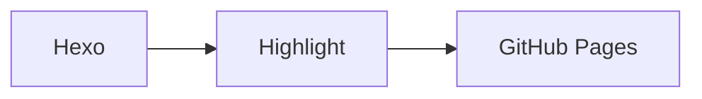

# Highlight

> 极简 Hexo 博客主题 — 让文字回归纯粹

**Highlight** 是一款极简风格的 Hexo 主题，灵感来自 [失眠海峡](https://blog.imalan.cn)。它摒弃一切冗余装饰，以薄荷绿为底色、衬线字体为核心、大量留白为骨架，让你的内容成为唯一的主角。

---

## 特性

- **极简设计** — 薄荷绿底色（`#F1F7F4`）+ 思源宋体 + 红棕强调色，克制而优雅
- **文章封面图** — 支持固定尺寸圆角封面，自动裁切 + 渐变标题叠加 + 悬停缩放
- **文章列表** — 分类标签、标题、摘要、日期四要素，清晰有序
- **全文搜索** — `Cmd/Ctrl + K` 快捷键呼出，实时过滤高亮，SVG 文件图标
- **归档页面** — 按年份分组的文章时间线，显示日期/标题/分类
- **分类页面** — 独立 Categories 页面，按字母排列，显示各分类文章数
- **代码高亮** — highlight.js 驱动，薄荷绿浅色主题，内置语言标签与复制按钮
- **Mermaid 图表** — 支持 Mermaid 流程图/时序图渲染，纯前端绘制
- **Obsidian 格式** — 兼容 Callout 与 Wiki-link 语法
- **响应式布局** — 完美适配桌面端与移动端
- **SEO 友好** — 语义化 HTML + Open Graph meta 标签
- **零依赖** — 纯 CSS + 原生 JS，无需任何前端框架
- **CDN 加速** — 内置 CDN 支持，可一键切换静态资源至 CDN
- **三栏页脚** — 左侧 CC 协议 · 居中 Hexo·Highlight · 右侧 RSS 订阅

## 快速开始

### 安装

```bash
cd your-hexo-blog
git clone https://github.com/your-username/hexo-theme-highlight themes/highlight
```

### 启用主题

编辑站点根目录的 `_config.yml`：

```yaml
theme: highlight
```

### 安装依赖插件

```bash
# 搜索功能 - 生成 search.json 数据文件
npm install hexo-generator-searchdb --save

# RSS 订阅 - 生成 atom.xml
npm install hexo-generator-feed --save
```

### 预览

```bash
hexo clean && hexo generate && hexo server -p 4000
```

打开浏览器访问 `http://localhost:4000` 即可看到效果。

---

## 插件配置

### hexo-generator-searchdb

用于生成搜索数据文件。在站点 `_config.yml` 中配置：

```yaml
search:
  path: search.json
  field: post
  content: true
  format: html
```

### hexo-generator-feed

用于生成 RSS 订阅。在站点 `_config.yml` 中配置：

```yaml
feed:
  type: atom
  path: atom.xml
  limit: 20
```

---

## 主题配置

在主题目录 `_config.yml` 中自定义各项设置：

```yaml
# ============================================
# Highlight Theme Configuration
# ============================================

# --- CDN 加速 ---
cdn:
  enable: true
  # 部署后填入你的 CDN 基础 URL（如 GitHub Pages 地址）
  url: ''
  # 第三方库 CDN 地址（可选覆盖）
  vendors:
    highlight_js: 'https://cdnjs.cloudflare.com/ajax/libs/highlight.js/11.10.0'
    highlight_css: 'https://cdnjs.cloudflare.com/ajax/libs/highlight.js/11.10.0/styles/atom-one-dark.min.css'
    mermaid: 'https://cdn.jsdelivr.net/npm/mermaid@11.6.5'

# --- 站点信息 ---
site_title: ''           # 站点名称（留空则使用站点 _config.yml 的 title）
site_subtitle: ''        # 副标题

# --- 风格配置 ---
style:
  accent_color: '#b74e4e'      # 强调色（分类标签、链接 hover 等）
  background_color: '#F1F7F4'  # 页面背景色（薄荷绿）
  text_color: '#2c2c2c'        # 正文颜色
  text_secondary: '#888'       # 辅助文字颜色
  border_color: '#e2efe6'      # 分隔线颜色

# --- 字体 ---
fonts:
  title_font: '-apple-system, "Noto Serif SC", "Source Han Serif SC", Georgia, serif'
  body_font: '-apple-system, "Noto Serif SC", "Source Han Serif SC", Georgia, serif'

# --- 布局 ---
layout:
  max_width: '720px'
  post_list_style: 'simple'

# --- 首页 ---
index:
  show_excerpt: true        # 是否显示文章摘要
  excerpt_length: 120       # 摘要最大字符数

# --- 文章页 ---
post:
  show_toc: false
  show_copyright: true      # 显示版权声明
  show_prev_next: true      # 显示上一篇/下一篇导航

# --- 代码高亮 ---
highlight:
  theme: one-dark           # 主题风格
  line_number: true         # 显示行号（需配合 Hexo 配置）
  copy_button: true         # 复制按钮
  lang_label: true          # 语言标签
  cdn_url: 'https://cdnjs.cloudflare.com/ajax/libs/highlight.js/11.10.0/highlight.min.js'

# --- 评论系统（Giscus） ---
# 使用 GitHub Discussions 作为评论系统
# 先在 GitHub 仓库中开启 Discussions，然后访问 https://giscus.app 获取配置
giscus:
  enable: false             # 是否启用 Giscus 评论
  repo: ''                  # GitHub 仓库，格式：用户名/仓库名
  repo_id: ''               # 仓库 ID（giscus.app 获取）
  category: ''              # Discussions 分类
  category_id: ''           # 分类 ID（giscus.app 获取）
  mapping: title            # 页面与 discussion 的映射方式
  theme: light              # 主题
  lang: zh-CN               # 语言

# --- 页脚 ---
footer:
  since_year: 2026          # 建站年份
  icp: ''                   # ICP 备案号
  custom_text: ''           # 自定义文字
```

---

## 使用指南

### 文章封面图

首页文章列表支持封面图展示。在文章 front-matter 中设置 `cover`、`photos` 或 `thumbnail` 字段即可启用：

```markdown
---
title: 我的文章标题
cover: /images/my-cover.jpg
---
正文内容...
```

**封面图特性：**

| 特性 | 说明 |
|------|------|
| 固定尺寸 | 宽度 100%，高度固定 240px |
| 圆角 | 12px 圆角（`border-radius: 12px`） |
| 自动裁切 | `object-fit: cover` 居中裁切，不受原图比例影响 |
| 标题叠加 | 底部渐变遮罩 + 白色标题文字 |
| 悬停效果 | 鼠标悬停时图片轻微放大（`scale(1.03)`） |
| 懒加载 | 内置 `loading="lazy"` 原生懒加载 |

**图片来源优先级（从高到低）：**

1. `cover` — 推荐使用，显式指定封面图
2. `photos[0]` — 相册首张图片
3. `thumbnail` — 缩略图
4. 正文第一张 `` — 自动提取（兜底方案）

未设置任何图片的文章保持纯文字列表样式不变。

### 文章摘要

首页文章列表会自动显示摘要。摘要获取优先级如下：

1. **Front-matter 手动指定**（推荐）

```markdown
---
title: 我的文章标题
description: 这是一段自定义摘要，会显示在首页列表中。
---
正文内容...
```

2. **自动截取** — 若未写 `description`，主题会从正文中提取前 120 个字符作为摘要。

3. **使用 `<!-- more -->`** — Hexo 的截断标记同样生效。

### 分类与标签

创建分类页面和标签页面：

```bash
hexo new page categories
hexo new page tags
```

编辑生成的 `source/categories/index.md`：

```yaml
---
title: Categories
layout: categories
---
```

编辑生成的 `source/tags/index.md`：

```yaml
---
title: Tags
layout: tags
---
```

导航栏已内置 **Categories** 链接，点击即可查看全部分类及对应文章数量，按字母顺序排列。

### 归档页面

点击导航栏的 **Archives** 链接即可访问，按年份自动分组展示所有文章，每条记录显示日期、标题和所属分类。

### 搜索功能

- 点击导航栏 **Search** 按钮
- 或使用快捷键 **`Cmd + K`**（Mac）/ **`Ctrl + K`**（Windows/Linux）
- 输入关键词实时搜索，匹配结果高亮显示
- 按 **ESC** 或点击 ✕/遮罩关闭

搜索结果列表使用 SVG 文件图标（非 emoji），支持标题和内容双字段匹配，150ms 防抖输入。

### 自定义页面

使用 `page` 布局即可创建独立页面：

```bash
hexo new page about
```

编辑生成的 `source/about/index.md`：

```yaml
---
title: About
layout: page
---
这里写你的内容...
```

### 代码块

主题内置薄荷绿配色的代码块样式，包含以下功能：

- **语言标签** — 代码块顶部显示语言名称（如 `JAVASCRIPT`、`PYTHON`）
- **复制按钮** — 一键复制代码内容，点击后显示「已复制」反馈
- **语法高亮** — highlight.js 驱动，自定义薄荷绿配色方案
- **行号支持** — 配合 Hexo `highlight.line_number: true` 使用
- **行内代码** — 薄荷绿背景 + 圆角，与代码块视觉统一

### Mermaid 图表

文章中可直接使用 Mermaid 语法编写流程图、时序图等，纯前端渲染，无需额外配置：

````markdown

````

支持的图表类型：flowchart（流程图）、sequenceDiagram（时序图）、classDiagram（类图）、stateDiagram-v2（状态图）等。

### 评论系统（Giscus）

主题内置 Giscus 评论支持。启用步骤：

1. 在 GitHub 仓库中开启 Discussions
2. 访问 [giscus.app](https://giscus.app)，填写你的仓库信息，获取配置参数
3. 在主题 `_config.yml` 中填写 Giscus 配置：

```yaml
giscus:
  enable: true
  repo: 你的用户名/你的仓库名
  repo_id: 从 giscus.app 获取
  category: General
  category_id: 从 giscus.app 获取
  mapping: title
  theme: light
  lang: zh-CN
```

然后 Hexo 站点 `_config.yml` 中配置 comments 相关：

```yaml
disqus_shortname:  # 可留空
```

### Obsidian 兼容格式

主题兼容以下 Obsidian 语法：
- **Callout** — `> [!note]` 等提示框语法
- **Wiki-link** — `[[链接]]` 双向链接语法

---

## 自定义样式

### 调整颜色

修改 `source/css/style.css` 中的 CSS 变量：

```css
:root {
  --accent: #b74e4e;       /* 强调色（分类标签、链接 hover 等） */
  --bg: #F1F7F4;            /* 页面背景（薄荷绿） */
  --text: #2c2c2c;          /* 正文颜色 */
  --text-secondary: #888;   /* 辅助文字 */
  --border: #e2efe6;        /* 分隔线 */
}
```

### 替换字体

修改 `--body-font` 和 `--title-font` 变量：

```css
:root {
  --title-font: "Noto Serif SC", "Source Han Serif SC", Georgia, serif;
  --body-font: "Noto Serif SC", "Source Han Serif SC", Georgia, serif;
}
```

默认使用 Google Fonts 加载的 **Noto Serif SC**（思源宋体），OFL 1.1 开源免费可商用。

### 封面图尺寸调整

修改 `.post-cover` 的高度值：

```css
.post-cover {
  height: 240px;   /* 默认 240px，可根据需要调整 */
  border-radius: 12px;
}
```

---

## 目录结构

```
highlight/
├── _config.yml              # 主题配置文件
├── package.json             # 包描述
├── README.md                # 主题文档
├── layout/
│   ├── layout.ejs           # 基础布局（HTML 结构 + 搜索/Copy/Mermaid 逻辑）
│   ├── index.ejs            # 首页模板（文章列表 + 封面图逻辑）
│   ├── post.ejs             # 文章详情模板（含 Giscus 评论）
│   ├── page.ejs             # 自定义页面模板
│   ├── archive.ejs          # 归档页面模板（按年份分组）
│   ├── categories.ejs       # 分类页面模板（字母排序 + 文章计数）
│   └── _partial/
│       ├── header.ejs       # 头部组件（站名 + 导航）
│       └── footer.ejs       # 页脚组件（CC 协议 · Hexo·Highlight · RSS）
└── source/
    ├── css/
    │   ├── style.css        # 全部样式（含封面图/归档/分类/搜索/Mermaid 等）
    │   └── obsidian.css     # Obsidian Callout/Wiki-link 样式
    └── js/
```

---

## 浏览器兼容性

| 浏览器 | 最低版本 |
|--------|---------|
| Chrome | 70+ |
| Firefox | 65+ |
| Safari | 12.1+ |
| Edge | 79+ |

主要使用了 CSS Grid/Flexbox、CSS 变量、`object-fit: cover` 等现代特性，不支持 IE。

---

## 许可证

[MIT License](LICENSE)

## 致谢

- 设计灵感来自 [失眠海峡](https://blog.imalan.cn)
- 基于 [Hexo](https://hexo.io/) 构建
- 搜索数据由 [hexo-generator-searchdb](https://github.com/theme-next/hexo-generator-searchdb) 生成
- RSS 订阅由 [hexo-generator-feed](https://github.com/hexojs/hexo-generator-feed) 生成
- 代码高亮由 [highlight.js](https://highlightjs.org/) 驱动
- 图表渲染由 [Mermaid](https://mermaid.js.org/) 提供
- 字体使用 [Noto Serif SC](https://fonts.google.com/noto/specimen/Noto+Serif+SC)（思源宋体）
- 评论系统由 [Giscus](https://giscus.app/) 提供
